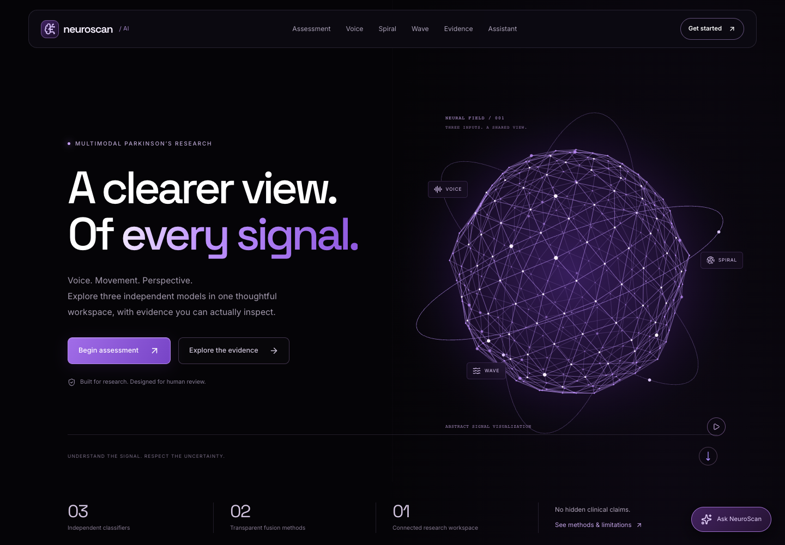
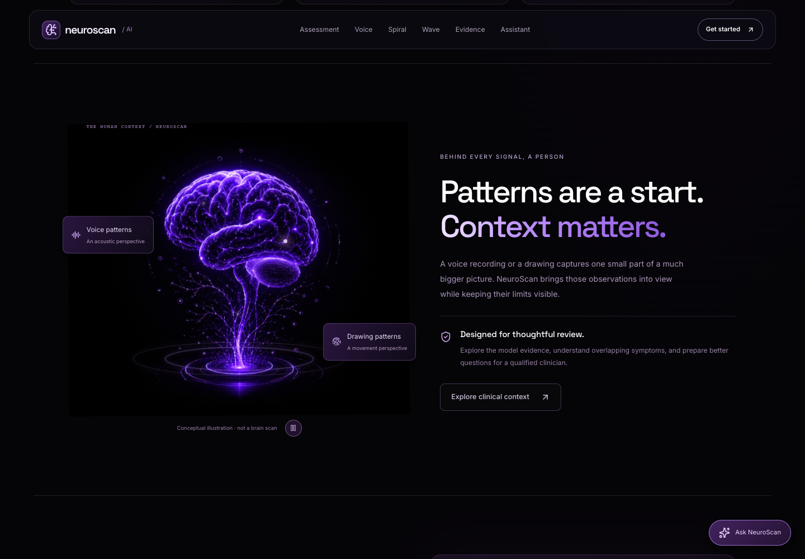

<div align="center">

# NeuroScan AI
### Three signals. One thoughtful workspace.

**Voice · Spiral · Wave — Parkinson’s pattern research with transparent evidence.**

Built by **Vipin Choudhary** · React + FastAPI + TensorFlow + scikit-learn

[Quick start](#quick-start) · [Models](#the-models) · [Deployment](#deployment) · [Model guide](docs/MODEL_GUIDE.md)

</div>



## What this application does

NeuroScan explores patterns in voice recordings, spiral drawings and wave drawings using three independent machine-learning pipelines. Visitors can upload drawings, record or upload audio, inspect individual results, and review model evidence. An assessment workspace compares multiple signals and exports a report for human review.

This is a research and education application. **It does not diagnose Parkinson’s disease, rule it out, or estimate a clinically validated disease risk.** Similar patterns can occur for other reasons. Clinical evaluation remains essential.

## Experience

- Purple, black and white interface with an animated neural sphere and interactive brain artwork.
- Voice recording and audio upload; spiral and wave image analysis.
- Real model inference, technical quality checks and clear errors when a model is unavailable.
- Multi-input assessments, adjustable importance weights, disagreement indicators and sensitivity comparisons.
- Same-person and explicitly labelled demonstration modes; downloadable JSON and printable reports.
- Evidence page with artifact-matched metrics and clearly separated fine-tuning experiments.
- Gemini-powered educational assistant with curated medical reading links. Messages are sent only when the visitor presses Send; uploads and predictions are not attached.
- Responsive layouts, reduced-motion support, animation pause controls and offscreen animation suspension.



## The models

There are **three independent prediction pipelines, not a fourth trained multimodal classifier**. The voice pipeline itself contains three classical algorithms.

| Pipeline | Architecture and training | Evaluation of deployed artifact |
| --- | --- | --- |
| Voice | StandardScaler + Random Forest, Gradient Boosting and SVM; soft voting with internal weights 3:2:2. Trained from acoustic features, without a pretrained neural voice model. | 110/114 correct: **96.49%** |
| Spiral | ImageNet-pretrained MobileNetV2 with a trained binary classification head. | 24/30 correct: **80%** |
| Wave | A separate ImageNet-pretrained MobileNetV2 classifier. | 24/30 correct: **80%** |

**Voice data:** 1,134 WAV filenames contained 567 unique recordings (287 healthy-labelled, 280 Parkinson’s-labelled). Exact duplicates were removed before the 453-training / 114-test recording split. The extractor calculates 193 acoustic features, including MFCC, delta, spectral and chroma statistics. It does not calculate jitter or shimmer. Participant identifiers are unavailable, so this is **recording-level evaluation, not patient-independent validation**.

**Drawing data:** each modality has 102 images: 72 development and 30 test images. The supplied training scripts reserve 14 development images for validation and fit on 58. The deployed historical drawing artifacts do not preserve complete training logs, so exact completed epoch counts are unknown. Filename-derived participant identifiers overlap between the supplied development and test folders, limiting the strength of these results.

| Pipeline | Confusion matrix: rows actual healthy/PD, columns predicted healthy/PD | PD sensitivity | Healthy specificity |
| --- | --- | --- | --- |
| Voice | `[[55, 3], [1, 55]]` | 98.21% | 94.83% |
| Spiral | `[[15, 0], [6, 9]]` | 60.00% | 100.00% |
| Wave | `[[13, 2], [4, 11]]` | 73.33% | 86.67% |

These are small, dataset-specific measurements. They are not clinical guarantees or directly comparable measures across modalities. A classifier score or displayed class confidence is not a calibrated probability that a person has the disease. Filenames and supplied sample labels never override model predictions.

### How the combined scores work

For available positive-weight signals, weights are normalized to sum to one:

- **Linear index:** `L = Σ(wᵢ × pᵢ)`.
- **Cobb–Douglas index:** `G = ∏(pᵢ ^ wᵢ)`, with scale factor 1.

For scores 0.2, 0.5 and 0.8 with equal weights, the indices are 0.500 and approximately 0.431. They summarize model outputs; they are **experimental indices, not validated combined probabilities**. Equal weights are a neutral default, not proven clinical importance. Missing or failed tests are excluded visibly. At least two contributing tests are required for an index.

Different cohorts can train independent models. Those models can then analyze three samples from the same new person. However, unrelated people’s recordings and drawings cannot be paired artificially to establish combined accuracy or learn clinical weights. See [paired data collection](docs/DATA_COLLECTION.md).

### Fine-tuning experiments

Separate drawing candidates used filename-derived groups: 48 fitting, 27 validation and 27 test images per modality. Stage selection used validation loss before test evaluation. The spiral candidate scored 19/27 (70.37%); the selected wave candidate scored 18/27 (66.67%). Their split differs from the historical evaluation. **They are not deployed and no improvement is claimed.** Experiment JSON summaries are included; candidate weights are excluded.

## Quick start

The bundled runtime model files are included; **retraining and downloading the raw datasets are not required to run the application**.

Use Node.js 22.12+ and a compatible Python environment. The current backend dependencies were tested on Apple Silicon with Python 3.13; a Linux deployment must be verified on its target runtime.

```bash
git clone https://github.com/VipinChoudhary-dev/NeuroScan_Parkinson.git
cd NeuroScan_Parkinson
python3 -m venv .venv
source .venv/bin/activate
python -m pip install -r backend/requirements.txt
python -m uvicorn backend.main:app --host 127.0.0.1 --port 8000
```

In another terminal:

```bash
cd frontend
npm ci
npm run dev
```

Open **http://localhost:5173**. API health: **http://localhost:8000/health**. API documentation: **http://localhost:8000/docs**.

### Optional assistant configuration

```bash
cp backend/.env.example backend/.env
```

Set `GEMINI_API_KEY` privately in that file, then restart the backend. Default provider/model: `gemini` / `gemini-3.5-flash-lite`. The Google account must have access and sufficient quota. Classifier analysis works independently of the assistant. Never put credentials in frontend variables or Git.

Chat exists in page memory; the backend does not persist it. Sending shares recent conversational context with Google, as explained beside Send. Reading links are curated sources, not live search results. The assistant provides general education, not diagnosis or prescribing.

## Deployment

**Frontend on Vercel; model API on a compatible Python backend host.**

1. Import this repository into Vercel.
2. Set **Root Directory** to `frontend` and framework to **Vite**.
3. Use build command `npm run build` and output directory `dist`.
4. Set `VITE_API_BASE_URL=https://YOUR-BACKEND-HOST` before building.
5. On the backend host, install `backend/requirements.txt`, retain `models/`, `test_samples/` and the experiment JSON files, and start `python -m uvicorn backend.main:app --host 0.0.0.0 --port 8000`.
6. Configure backend `ALLOWED_ORIGINS` to the exact HTTPS frontend origin. Set the Google key only in backend secrets.
7. Confirm `/health`, a healthy and a PD-labelled demo for each modality, microphone capture, route refreshes and assistant failure handling on the deployed environment.

`frontend/vercel.json` supplies the SPA route fallback described in [Vercel’s Vite documentation](https://vercel.com/docs/frameworks/frontend/vite). This frontend configuration does not host the Python model service. HTTPS is necessary for browser microphone access outside localhost. See [deployment details](docs/DEPLOYMENT.md) for rate limits, upload limits and proxy configuration.

## Repository map

```text
frontend/       React interface, public assets and Vercel configuration
backend/        FastAPI endpoints, feature extraction, quality checks and assistant
models/         Deployed weights, scaler and evaluation metadata
scripts/        Training, audit, fine-tuning and browser verification utilities
test_samples/   Numbered demonstration inputs used by the application and tests
docs/           Plain-language model guide, methodology and deployment guides
reports/        Small fine-tuning summaries used by the Evidence page
```

Raw training datasets, virtual environments, node_modules, build outputs, credentials, temporary reports and experimental candidate weights are excluded. Training scripts expect the original local `Voice_Dataset/` and/or `dataset/` layout. Obtain appropriately licensed datasets separately before reproducing training; this repository is not a complete archived training corpus. The bundled demos are labelled examples, not independent validation evidence.

## Verification

```bash
python -m pip install -r backend/requirements-dev.txt
python -m pytest backend/tests -q
npm --prefix frontend run lint
npm --prefix frontend run build
```

The two full drawing-corpus tests skip when the optional original dataset is absent. Bundled real-model samples, feature processing, corrupt uploads, unavailable-model errors, fusion math and mocked assistant behavior remain testable. Browser scripts require Playwright and running frontend/backend services; the premium script mocks provider responses deliberately.

## Documentation and future validation

- [Easy-language model guide](docs/MODEL_GUIDE.md)
- [Methodology and limitations](docs/METHODOLOGY.md)
- [Paired cohort collection plan](docs/DATA_COLLECTION.md)
- [Hosting and assistant configuration](docs/DEPLOYMENT.md)

Useful next research steps include confirmed participant-level splits, larger independent cohorts, external validation, probability calibration, paired multimodal data and clinician-reviewed evaluation against conditions with overlapping symptoms. Public hosting does not establish medical-device validation. No clinical certification, patient-record system or authentication is supplied.

## Credits and rights

Created by **Vipin Choudhary**. MobileNetV2 uses ImageNet pretraining; the application uses open-source packages and an optional Google Gemini service. Their respective terms apply. Dataset source/licence documentation is incomplete, and no new blanket licence is assigned to third-party data or model artifacts. Review provenance and redistribution rights before reuse. This repository currently does not grant a general open-source licence.

© 2026 Vipin Choudhary · NeuroScan AI. For research and education. Results are not medical diagnoses.
